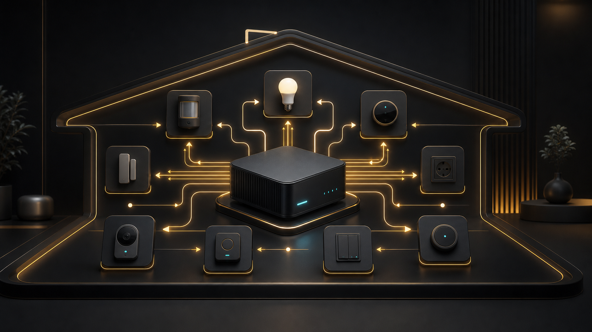

# Extaas and Home Assistant

The Extaas Home Assistant ecosystem connects local Node.js applications to Home Assistant, runs applications as add-ons and manages custom plugin installation. The components are separate tools: choose only the one that solves the actual need.

  
INTEGRATION<h3>Node ↔ Home Assistant</h3>
Dynamic sensors, switches and buttons on the local network.

  
ADD-ON<h3>Run an application</h3>
A background service or Node/Svelte UI available through Ingress.

  
OPERATIONS<h3>Install with control</h3>
Private repositories, environment variables, versions and recovery.

## Components and purpose

| Component | What does it do? | When should it be used? |
| --- | --- | --- |
| **Extaas custom integration (`extaas_com`)** | discovers Node clients through Zeroconf and creates sensors, switches and buttons from their data | when custom Node.js service state and controls should appear in Home Assistant |
| **Node Server** | clones configured private GitHub Node.js repositories and runs them as an HA add-on | when an application does not need its own Home Assistant sidebar UI |
| **Node Server UI** | the same concept with Ingress and a UI on port 3000 | when a Node/Svelte application should open inside the HA sidebar |
| **X Plugins Installer** | periodically installs and updates custom plugins from GitHub repositories | when distributing controlled custom components across HA installations |
| **Popcorn** | a SvelteKit application for discovering titles, linking streaming sources and tracking release dates | when a media-discovery tool is wanted in a Home Assistant Ingress view |

## Why use the custom integration?

A normal Node.js application and Home Assistant do not automatically share a device model. `extaas_com` creates a local contract between them:

1. Node advertises `_extaas_com._tcp.local.` via Zeroconf.
2. Home Assistant offers the discovered service for setup.
3. Node sends its `node_data` description to `/api/extaas_com`.
4. The integration creates dynamic entities and groups them as devices.
5. HA sends switch or button actions to Node's `/update` endpoint.
6. `/heartbeat` tells the integration whether Node is online.

This fits prototypes, local controllers, sensor hubs and custom services whose entities change with software configuration. Dynamic entities reduce the need to write separate Home Assistant platform code for every sensor.

## Entity model

- **sensor** reports a measurement or state;
- **switch** reports state and accepts on/off commands from Home Assistant;
- **button** triggers a one-shot action on Node;
- `device` groups related entities;
- `icon` supplies a Material Design Icons identifier;
- sensor `device_class`, `unit` and `state_class` help Home Assistant display values and generate statistics.

Use `measurement` for current measurements and `total_increasing` only for a counter that normally never decreases, such as total energy. The unit must match the Home Assistant device class. An invalid combination can break statistics or trigger repair warnings.

## Node Server or Node Server UI?

Choose **Node Server** for a background service that talks to APIs or hardware and needs only logs/configuration. Choose **Node Server UI** when users need the application's web UI in the Home Assistant sidebar. The UI variant uses Ingress, expects the application on port 3000 and uses host networking.

Both variants accept a GitHub token, repository list and environment variables. The repository must contain a runnable Node.js project whose dependencies and start command are correctly defined by the project itself.

## Security

- A GitHub token is a secret. Use a fine-grained token with minimum repository read access and rotate it.
- Never put the token in a repository URL, log, README or public issue.
- `host_network: true` gives an add-on broad network reach; use it only when local discovery or service ports require it.
- `/update`, `/heartbeat` and other application endpoints are local network APIs. Validate payloads, limit body size and add authentication where the network is not fully trusted.
- Zeroconf is discovery, not authentication. Finding a service does not prove authorisation to control it.
- Do not expose an Ingress application's internal port through the router. Use secure Home Assistant remote access or a properly configured VPN.
- Environment variables may contain secrets; applications must not render them in UI or error logs.

## General installation flow

1. Add `https://github.com/Osauhing-X/home-assistant` as an add-on repository in Home Assistant.
2. Refresh the Add-on Store and select the required add-on.
3. Complete configuration. For Node Server, add a fine-grained GitHub token, `owner/repository.git` entries and required `NAME=value` environment variables.
4. Start the add-on and inspect logs until application startup is confirmed.
5. For the UI variant, open Ingress from the sidebar; for a background service, test its API or integration entities.
6. Create a Home Assistant backup before enabling plugin auto-installation or a major upgrade.

## Node client contract

The Node client has at least three responsibilities:

- provide `GET /heartbeat` with a successful response while healthy;
- provide `POST /update`, validate permitted entity values and execute actions;
- send Home Assistant its host, port and `node_data` as JSON.

Every entity key needs a stable machine name. Renaming it can create a new entity in Home Assistant. Do not place secrets or very large objects in values. Button actions should be idempotent or guard against accidental duplicate requests.

## Troubleshooting

### Home Assistant does not discover Node

Verify both are on an mDNS-capable network, Node advertises `_extaas_com._tcp.local.`, the advertised host is not loopback or a Docker virtual interface, and the port is reachable. VLANs and guest networks often block multicast DNS.

### Entity is unavailable

Check Node's `/heartbeat`, add-on log, advertised IP and port. Then check whether the Node process restarts or its address changed. Use a DHCP reservation for a stable address.

### A switch changes back

HA sent `/update`, but Node did not save the value or returned the old state in its next sync. Update Node's internal source of truth, execute the physical action and then report the actual state to Home Assistant.

### Sensor has no statistics

Verify the value is numeric, `device_class`, `unit` and `state_class` agree, and a `total_increasing` counter does not decrease during normal operation.

### Node Server cannot clone a private repository

Check token expiry, repository read permission, `owner/repository.git` format and GitHub access. Do not expose the token when copying an error report.

### Ingress shows a blank or broken page

Ensure the application listens on all interfaces inside the container, uses port 3000, supports the Ingress base path and does not force redirects to an external hostname.

## Updates and recovery

Read the changelog, create a Home Assistant backup and test in a non-critical installation before upgrading. After an integration update, restart Home Assistant if required; after an add-on update, verify startup logs and entities. Keep the previous known-good repository commit or add-on version available for recovery.

X Plugins Installer checks periodically (3600 seconds by default). Automatic updating reduces manual work but increases regression risk. For critical automation, prefer pinned, verified versions or a controlled release process.

## Limitations

The current architecture primarily targets local-network integration. It is not by itself a cloud message queue, a high-security device protocol or a guarantee of uninterrupted control. Life-safety, fire, alarm or other safety-critical functions require independent fail-safes and certified systems.

## Related resources

- [Home Assistant source and add-on repository](https://github.com/Osauhing-X/home-assistant)
- [Workspace modules](/en/docs/modules-overview)
- [Choosing integrations](/en/docs/integrations-guide)
